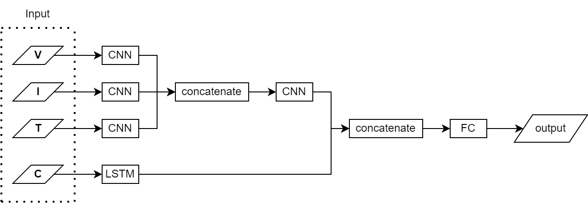
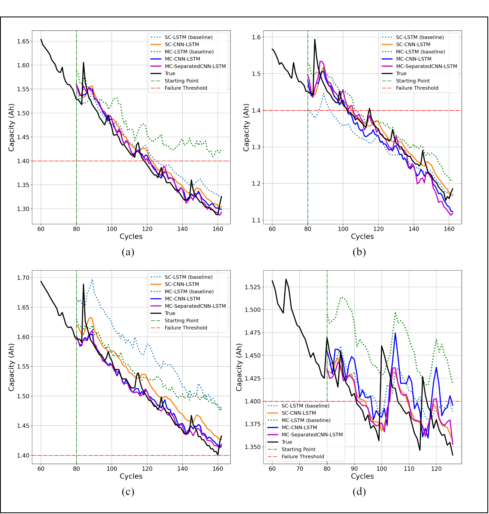

# A Hybrid CNN-LSTM for Battery Remaining Useful Life Prediction with Charging Profiles Data
[](https://doi.org/10.1145/3575882.3575903)

+ Battery RUL prediction using data-driven method based on a hybrid deep model of Convolutional Neural Networks (CNN) and Long-Short Term Memory (LSTM).
+ CNN and LSTM are used to extract features from multiple measurable data (Voltage, Current, Temperature, Capacity) in parallel.
+ CNN extracts features of multi-channel charging profiles, whereas LSTM extracts features of historical capacity data of discharging profiles which related to time dependency.
+ This repository provides the code for training in python.
---
### Framework:

+ Voltage (V), Current (I), and Temperature (T) inputs will each get in the CNN layer separately.
  + Feature V gets into a different CNN layer with features I and T, as well as a feature I get into a separate CNN layer with V
  and T, and so on.
  + The output from the CNN layer for each feature, is then concatenated. Then they get the next CNN layer
  + The extracted features in the last CNN layer is concatenated with the output of the LSTM layer.

### Results


| Model        |  RMSE  |   MAE  | MAPE (%) |
|--------------|:------:|:------:|:--------:|
| SC-LSTM      | 0,0620 | 0,0549 |  3,6080  |
| MC-LSTM      | 0,0403 | 0,0340 |  2,2847  |
| SC-CNN-LSTM  | 0,0270 | 0,0215 |  1,3804  |
| MC-CNN-LSTM  | 0,0359 | 0,0291 |  1,9346  |
| MC-SCNN-LSTM | 0,0276 | 0,0220 |  1,4207  |

+ SC : Single Channel, MC : Multi Channel
+ The performance of prediction models were compared  using some evaluation metrics
including root mean square error (RMSE), mean absolute error
(MAE), and mean absolute percentage error (MAPE).
+ The hybrid model with excellent feature extraction helps to produce more accurate prediction.
+ The MC-SCNNLSTM, MC-CNN-LSTM, and SC-CNN-LSTM model’s prediction results produce predictive values that are close to actual values and are better than the baseline model.
+ Hybrid  of CNN-LSTM model achieves 61%, 37%, and 15% performance
improvements of MAPE in terms of SC-CNN-LSTM, MC-SCNN-LSTM, and MC-CNN-LSTM respectively, compared to using the single model


### How to Cite

```
  @inproceedings{10.1145/3575882.3575903,
  author = {Hafizhahullah, Huzaifi and Yuliani, Asri Rizki and Pardede, Hilman and Ramdan, Ade and Zilvan, Vicky and Krisnandi, Dikdik and Kadar, Jimmy},
  title = {A Hybrid CNN-LSTM for Battery Remaining Useful Life Prediction with Charging Profiles Data},
  year = {2023},
  isbn = {9781450397902},
  publisher = {Association for Computing Machinery},
  url = {https://doi.org/10.1145/3575882.3575903},
  doi = {10.1145/3575882.3575903},
  booktitle = {Proceedings of the 2022 International Conference on Computer, Control, Informatics and Its Applications},
  pages = {106–110},
  numpages = {5},
  keywords = {Lithium-ion battery, remaining useful life, capacity prediction, CNN-LSTM, neural networks},
  }
```